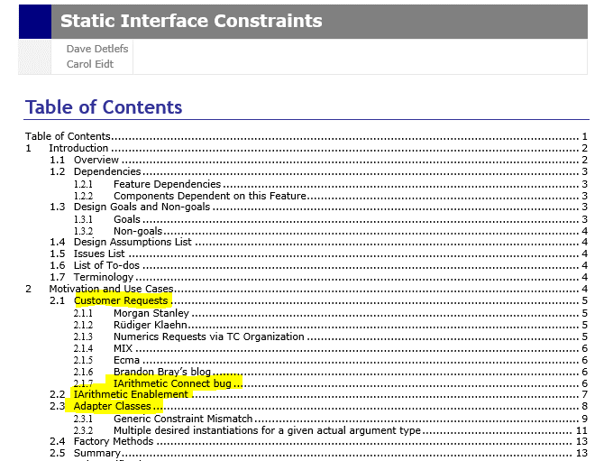
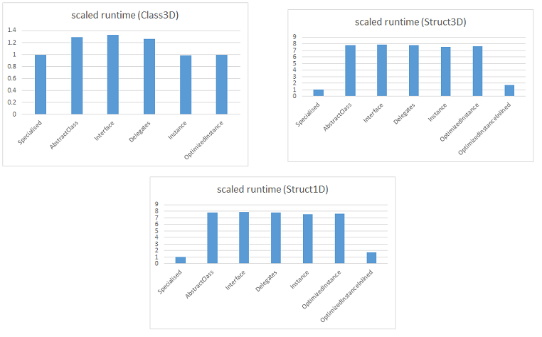

# Concept C#: Type Classes for the Masses

*(A natural representation for type classes in .NET)*

* Claudio Russo (MSR)
* Matt Windsor (York) (the amazing intern who did most of the hard C# work!)

---

##  Haskell trumps ML! 


--

### **How annoying!** 

---

## Introduction

Type classes are an immensely popular and productive feature of Haskell.

(Almost as good as modules, sometimes better!)

So good, other languages have stolen them:
 * ~~C++ concepts~~ (for perf!)
 * Scala *implicits*
 * Rust *traits* 
 * Swift *protocols*
 * Coq (2 variants),Agda, Clean....

--

But not C# or F#.

--


---
##This talk:

We add type classes to C# using a cheap coding trick that is

* type preserving (no yucky erasure)
* efficient (thanks to .NET's run-time code specialiation)
* essentially free (zero VM modifications required)
* modular

For C#, we call a type class a *concept* and an instance an *instance*.

The same technique works interoperably for F# etc.

(In F#, a type class is called *trait* and an instance *witness*).


*Concept C#*
and *Trait F#* 
are implemented as open source prototypes.

https://github.com/CaptainHayashi/roslyn/blob/master/concepts/docs/concepts.md)


---

##  Recap: Haskell Type Classes

Type classes are an abstraction mechanism for describing generic algorithms.

A *type class* is a predicate on types that specifies a set of required operations by signature.

A *class instance* declares class membership of a type by implementing each operation.

Type classes form hierarchies with *inheritance* and *subsumption*. 

A *generic instance* defines *families* of instances, predicated on class membership.


---


## Why should .NET care?

Instance declarations are decoupled from their types (unlike an OO class' interfaces).

Type classes can have less overhead than OO abstractions. Even zero overhead.

Type classes allow efficient abstraction over numeric types (sorely missing in .NET).

---

##  ~~"Static Interface Methods for the CLR"~~

.NET team previously proposed and prototyped "Static Interface Methods for the CLR", 
driven by customer demand for *efficient* abstraction over numeric types.

Why didn't this proposal make it?
* It required both runtime & framework changes (too expensive).
* It has soundness issues (too risky).

Our approach:
* requires *no* changes to the runtime or frameworks.
* Is *sound by construction* (due to evidence passing).




---

## Generics Recap

define *Generics*: object-oriented lingo for *F-bounded parametric polymorphism* 

---

## Java/JVM enerics

Java generics are a fiction of the compiler's imagination.

Compiled by "erasing type parameters to their bounds or `object`".

*Erasure Semantics* means the Java VM knows nothing about type parameters, let alone their instantiations .

All instantiations of generic type must have the same least common denominator representation (a heaper pointer).

Because of erasure, Java has to rule out certain (arguably useful!) constructs:

```java
new T()         // illegal Java allocation
new T[100]      // illegal Java array construction
(T) o           // illegal Java cast 
(List<Int>) o   // illegal Java cast
List<Int>       // legal, but boxes every entry (fat and slow)
List<int>       // illegal, instantiation not pointer sized 
sizeof(List<Int>) == sizeof(List<Bool)) == sizeof(List<String>) 
```

(Hack is similar)
---

## C#/F#/CLI Generics

In C#, Generics are built into the runtime (through dedicated bytecodes & type information).

Compiled by "passing types at runtime".

*Type Passing* means the CLI VM knows about type parameters and their instantiations at runtime.

The runtime is free to choose different sized representations for different types, even when used as type arguments.

```csharp
new T()         // legal C#
new T[100]      // legal C#
(T)o            // legal C#
(List<int>) o   // legal C#
List<byte>       // legal, note instantiation not pointer sized 
sizeof(List<int>) =/= sizeof(List<bool>) =/= sizeof(List<String>)
// even THIS is ok (though it arguably isn't...)
if (typeof<T> == typeof<int>) 
   Write("I just broke parametericity!");  
```

---

## Code Specialization

Importantly, for performance, the CLR generates specialised code for particular instantiations (Kennedy & Syme, 2001)

Types comes in two flavours:
* *value types* (scalar primitives & user defined structures). 
   Cheaply stack-allocated, passed by value.
* *reference types* (objects & arrays). 
   Expensively heap-allocated, passed by reference.

Type parameters range over/can be instantiated with both flavours.

Code instantiated at *reference* (ie. heap) types (`object`,`string`, `int[]`) is *shared* between all reference type instantiations (with some indirection
for type specific operations) (to avoid code bloat).

Code instantiated at *value* types (`int16`, `int32`, `point`) is *specialized* for each instantiation.

Code instantiated at mixtures of reference and non-reference types is "partially" specialized (it's complicated).

---

## Benefits of Specialization

Specialization  typically happens *just-in-time* (i.e. at run time, at first unseen instantiation). 

Specialization replaces statically unknown representation sizes by dynamically known ones.

Like static inlining, type specialization can turn indirect calls (to *unknown* functions) into faster, direct calls to *known* functions. 

Futhermore, *known* functions can be *inlined*, removing function call overhead altogether and exposing yet more optimizations.

(An run time version of C++'s compile time type specialization.)

---


---
##  Haskell Type Classes
 
We represent a Haskell type class, e.g.

```Haskell
  class Eq a where 
    (==) :: a -> a -> Bool
```

as a *generic* C# *interface*:
```csharp
  interface Eq<A>
  {
    bool Equal(A a, A b);
  }
```

*Concept C#* just adds a distinctive `concept` keyword.

```csharp
  concept Eq<A>
  {
    bool Equal(A a, A b);
  }
```
---

## Haskell Overloads

The Haskell declaration of class `Eq a` implicitly declares the overload:

```Haskell
    (==) :: (Eq a) => a -> a -> Bool  -- note the added constraint!
```

In C#, an overload  can be encoded as a generic static method, parameterized by an additional type parameter `'EqA`.

C#
```csharp
static class Overloads {
  public static bool Equal<A,EqA>(A a,A b) where EqA:struct,Eq<A> =>
    default(EqA).Equal(a, b);
}
```

The ordinary type parameter `EqA` is:
* constrained to be a `struct` (allocable on the stack); 
* bounded by its interface (`EqA: Eq<A>`);
* a named *witness* for the constraint `Eq<A>`.

(think `Equal`: `forall A, EqA : Eq<A>. A -> A -> bool`)


> *Haskell dictionary value ~ C# witness type*

---

## Zooming in

Look closely:

C#
```csharp
static class Overloads {
  public static bool Equal<A,EqA>(A a,A b) where EqA:struct,Eq<A> =>
    default(EqA).Equal(a, b);
}
```

Where is the *value* parameter for the "dictionary" that GHC would insert?

--

We don't need one!

In C#, primitive `default(T)` has type `T` and returns a default value.

Using `default(T)`, we can create dictionary values on demand, when required for method calls.

Doing so explicitly is gross, so in Concept C#, we allow unqualified calls to methods on
"dictionary" type parameters that are in scope.

(The `struct` constraints ensure dictionary values are never 'null'; no call can fail.)

---

Instead of the C#:

```csharp
public static bool Equal<A,EqA>(A a,A b) where EqA:struct,Eq<A> =>
  default(EqA).Equal(a, b);
```

in Concept C#, we instead write:
```csharp
public static bool Equal<A,implicit EqA>(A a,A b) where EqA:Eq<A> =>
  Equal(a, b); 
```

The `implicit` keyword declares a dictionary type parameter whose methods are available sans qualification,
and whose instantions are inferred from the accessible
concept/instance hierarchy.

---


## Haskell Instances

A Haskell ground instance, eg.

```Haskell
  instance Eq Integer where 
    x == y                =  x `integerEq` y
```

is translated to a C# *struct* implementing a concept (i.e. interface).

```csharp
  struct EqInt : Eq<int>  {
    public bool Equal(int a, int b)  => a == b; 
  }
```

The struct is empty (think `unit`) but (!) has associated code.

In Concept C#, we use the instance keyword instead:

```csharp
  instance EqInt : Eq<int> {
    public bool Equal(int a, int b)  => a == b; 
  }
```

Altough they compile to struct declarations, instances are special since can be used to instantiate
'implicit' type parameters.

---


##  Generic Instances...

Haskell's generic instances define *families* of instances.

E.g. 

Given an equality type `a`, we can define an equality
on *lists* of `a` (written `[a]`):

```Haskell
  instance (Eq a) => Eq [a] where 
       nil == nil      = true
    (a:as) == (b:bs)   = (a == b) && (as == bs)
         _ == _        = false
```

---

## ...Generic Instances

We can represent a Haskell *parameterized instance* as a *generic struct*, 
implementing an interface but parameterized by suitably constrained type parameters. 

Substituting, for simplicity, arrays for lists in CS we can write: 

```csharp
struct EqArray<A, EqA> : Eq<A[]> where EqA : struct, Eq<A> {
  public bool Equal(A[] a, A[] b) {
    if (a.Length != b.Length) return false;
    for (int i = 0; i < a.Length; i++)
      if (!(default(EqA).Equal(a[i], b[i]))) return false;
    return true;
  }
}
```
Concept C#:
```csharp
instance EqArray<A, implicit EqA> : Eq<A[]> where EqA : Eq<A> {
  bool Equal(A[] a, A[] b) {
    if (a.Length != b.Length) return false;
    for (int i = 0; i < a.Length; i++)
      if (!Equal(a[i], b[i])) return false;
    return true;
  }
}
```

---

## Constructing Evidence

Derived instances allow Haskell to automatically construct instances as evidence for constraints:

```Haskell
  --- Since Eq Integer and Eq a => Eq (List a),
  --- we have Eq (List Integer) hence Eq (List (List Integer))
   
   [[1],[2,2],[3,3,3]] == [[3,3,3],[2,2],[1]]  -- typechecks!
```

In C#, `EqInt:Eq<int>` so `EqArray<int,EqInt>:Eq<int[]>` so `EqArray<int[],EqArray<int,EqInt>>:Eq<int[][]>`.

In C#, dictionary type arguments cannot be inferred... they usually don't occur elsewhere in the type!

```csharp

   bool Equal<A,EqA>(A a, A b) where EqA: struct, Eq<A>;

   Equal( {{1},{1,2},{1,2,3}}, {{1,2,3},{1,2},{1}} ) 
     // type error, C# can't infer type arguments!
   
   Equal< EqArray<int[],EqArray<int,EqInt>>,int[]> , int[][]>
   	( {{1},{1,2},{1,2,3}}, {{1,2,3},{1,2},{1}} ) 
     // typechecks (but kills the programmer)
```


Programming in the encoding requires intolerable degree of explicit type abstraction and instantiation.

---

## Instance Inference

No programmer should write this crap!

In Concept C#, we extend type argument inference so:
* ordinary and implicit type arguments can be omitted and inferred;
* ordinary type arguments can be provided but implicit type arguments can be omitted and inferred;
* ordinary and implicit type arguments can be provided (when necessary).

Concept C#:
```csharp

  bool Equal<A,implicit EqA>(A a, A b) where EqA:Eq<A>;

  Equal({{1},{1,2},{1,2,3}},{{1,2,3},{1,2},{1}}) 
   // type checks: implicit parameter inferrable from argument type

  Equal< int[][] >({{1},{1,2},{1,2,3}},{{1,2,3},{1,2},{1}}) 
   // also checks(used when C# type inference fails)

  Equal< int[][], EqArray<int[],EqArray<int,EqInt>> >
       ({{1},{1,2},{1,2,3}},{{1,2,3},{1,2},{1}})
   // also checks (used when implicit inference fails).
```

'implicit' type parameters are inferred using instance driven backchaining, similar to Haskell.
---


##  Derived Operations 

We translate Haskell's qualified types as extra, bounded type parameters denoting witness parameters.

For example, equality based list membership in Haskell is defined as follows:

```Haskell
  elem :: Eq a => a -> [a] -> bool
  elem x []      = False
  elem x (y:ys)  = x==y || (elem x ys)  
``` 

In C#, we can define:
```csharp
static bool Elem<A,EqA>(A x, A[] ys) where EqA : struct, Eq<A> {
  for (int i = 0; i < ys.Length; i++)  {
    if default(EqA).Equal(x, ys[i])) return true;
  }
  return false;
}
```

Concept C#:
```csharp
static bool Elem<A,implicit EqA>(A x, A[] ys) where EqA : Eq<A> {
  for (int i = 0; i < ys.Length; i++) {
    if (Equal(x, ys[i])) return true;
  }
  return false;
}
---

##  Example: Numeric types

Haskell has a rich numeric hierarchy (think |IArithmetic|)
```Haskell
  class Num a where
    Add: a -> a -> a
    Mult: a -> a -> a
    Neg: a -> a
  
  instance Num Integer where
    Add a b = a + b
    Mult a b = a * b
    Neg a  = -a
  
  instance Num Float where 
    ...
``` 

C#:
```csharp
interface Num<A> {
    A Add(A a, A b);
    A Mult(A a, A b);
    A Neg(A a);
  }

struct NumInt : Num<int> {
    public int Add(int a, int b) => a + b; 
    public int Mult(int a, int b) => a * b; 
    public int Neg(int a) => -a;
  }
```

Concept C#:
```csharp
concept Num<A> {
    A Add(A a, A b);
    A Mult(A a, A b);
    A Neg(A a);
  }

instance NumInt : Num<int> {
    int Add(int a, int b) => a + b; 
    int Mult(int a, int b) => a * b; 
    int Neg(int a) => -a;
  }
```

---

##  Type Class Inheritance

Haskell supports (multiple) inheritance of super classes.

```Haskell
  class (Eq a) => Num a where
    Add: a -> a -> a
    Mult: a -> a -> a
    Neg: a -> a
```

* Forall types `a`, `Num a` derives from `Eq a`. 

(Is it just me or is Haskell's `=>` the wrong-way round?).

In C#, we instead use (multiple) interface inheritance C#:
```csharp
interface Num<A> : Eq<A> {
  A Add(A a, A b);
  A Mult(A a, A b);
  A Neg(A a);
}
struct NumInt : Num<int> {
  public bool Equal(int a, int b) => default(EqInt).Equal(a, b);
  public int Add(int a, int b) => a + b;
  public int Mult(int a, int b) => a * b; 
  public int Neg(int a) => -a;
}
```

---

## ... Inheritance

Concept C#:
```csharp
concept Num<A> : Eq<A> {
  A Add(A a, A b);
  A Mult(A a, A b);
  A Neg(A a);
}
instance NumInt : Num<int> {
  bool Equal(int a, int b) => EqInt.Equal(a, b); 
       // named instance EqInt useful here (c.f. Haskell)
  int Add(int a, int b) => a + b;
  int Mult(int a, int b) => a * b; 
  int Neg(int a) => -a;
}
```

* Haskell class inheritance ~ C# interface inheritance 

---
##  Subsumption ...
Subsumption derives (evidence for) a class from (evidence for) its subclasses.

```Haskell
    equal :: (Eq a) => a -> a -> Bool

    square :: (Num a) => a -> a 
    square a = a * a

    memsq :: (Num a) => [a] -> a -> Bool
    memsq nil a = false
    memsq (h:t) a =     equal h (square a) 
                     -- ^^^^ legal coz Num a |= Eq a 
                     || memsq h t
```
---

##  ... Subsumption


C#:
```csharp
static bool Equal<EqA, A>(A a, A b) where EqA : struct, Eq<A> 
  => default(EqA).Equal(a, b);
static A Square<A,NumA>(A a) where NumA : struct, Num<A> 
  => default(NumA).Mult(a, a);
static bool MemSq<A,NumA>(A[] a_s, A a) where NumA: struct, Num<A>
{ for (int i = 0; i < a_s.Length; i++) 
    if (Equal<A,NumA>(a_s[i], Square<NumA, A>(a))) return true;
             /*  ^^^^ legal only because NumA : Num<A> : Eq<A> */
  return false;
}
```
Concept C#:
```csharp
static bool Equal<A,implicit EqA>(A a, A b) where EqA : Eq<A> 
  => Equal(a, b);
static A Square<A,implicit NumA>(A a) where NumA: Num<A> 
  => Mult(a, a);
static bool MemSq<A,implicit NumA>(A[] a_s, A a) where NumA: Num<A>
{ for (int i = 0; i < a_s.Length; i++) 
    if (Equal(a_s[i], Square(a))) return true;
     /*  ^^^^ legal only because  NumA : Num<A> : Eq<A> */
  return false;
}
```
---

## MSIL ByteCode

```csharp
public static bool Equal<A,EqA>(A a,A b) where EqA:struct,Eq<A> =>
  default(EqA).Equal(a, b);
```

Compiles to (something like) CIL generic bytecode:

```c
.method public static bool Equal<A, 
                                 struct .ctor(class Eq<!!A>) EqA> 
   (!!A a,!!A b) 
   cil managed {
   .locals init ([0] !!EqA loc1)
   ldloca.s loc1      // stack allocate dictionary
   initobj !!EqA      // initialize (empty) dictionary
   ldloca.s loc1      // load address of dictionary onto stack
   ldarg.0            // load argument 1   
   ldarg.1            // load argument 2
   constrained. !!EqA // pseudo virtual call through dictionary
   callvirt instance bool class Eq<!!A>::Equal(!0, !0) 
   ret
}
```
The `callvirt` instruction is typically used for an indirect call to a virtual method.

When actual type `EqA` is a struct, due to specialization, the callee is always known and often inlined.

---


### Performance

Evaluating a polynomial `f(x:T) = x*x + x + (T)666` (in C#), 

where `T`=`int`, `double`, `Class3D`, `Struct3D`.

(We evaluate `f(x)` at `1m` values of `x` using the BenchmarkDotNet harness.)

```csharp
T ConceptGenericOpt<T, NumT>() where NumT : struct, Num<T> {
  NumT NI = default(NumT);
  T y = NI.FromInteger(0);
  T c = NI.FromInteger(666);
  for (int i = 0; i < n; i++) {
    T x = NI.FromInteger(i);
    y = NI.Plus(NI.Plus(NI.Mult(x,x),x), c);
  }
  return y;
}
```

Comparisons:
+ Baseline: non generic, hand-specialized  code (one per T)
+ AbstractClass: generic class based (OOP style)
+ Interface: generic interface based (OOP style)
+ Delegate: generic, firt-class function based (OOP/FP style)
+ Instance: trait based (one dictionary value per call)
+ OptimizedInstance: optimized trait based (CSE on dictionaries) (shown above)
+ OptimizedInstanceInlined: optimized trait based (CSE on dictionaries) with C# static operator definitions inlined in witness declaration.
---
###  Relative Performance at Scalar types


(lower is better - ideally leftmost baseline (non-generic, hand-specialized code) equals rightmost generic, trait-based code.

At scalar primitive value type instantiations, trait performance is:
* as good as hand specialised code, 
* at least *8-14x faster* than standard OO abstractions.

---

### Relative Performance at Compound Types



(lower is better - ideally leftmost baseline (non-generic, hand-specialized code) equals rightmost generic, trait-based code.

At 3-field class and struct instantiations, performance can be competive with hand specialised code, 
1.4-8x faster than OO abstractions (if we are careful to inline).

---

##x86  (DEBUG)

This, in  outline, is the x86 code jitted at `NumInt:Num<int>`:
The real code is *64 lines* of suboptimal masm (yuck).


```masm
    696:             NumT NI = default(NumT);
    01140628  lea         eax,[ebp-10h]  
    0114062B  mov         byte ptr [eax],0  
    697:             T y = NI.FromInteger(0);
... 01140633  call        dword ptr ds:[0C65E78h]   ...
    698:             T c = NI.FromInteger(666);
... 0114064A  call        dword ptr ds:[0C65E78h]   ...  
    699:             for (int i = 0; i < n; i++) {
    700:                 T x = NI.FromInteger(i);
... 01140668  call        dword ptr ds:[0C65E78h]  ...
    701:                 y = NI.Plus(NI.Plus(NI.Mult(x,x),x), c);
... 0114068C  call        dword ptr ds:[0C65E8Ch]  ... 
... 0114069E  call        dword ptr ds:[0C65EA0h]  ...  
... 011406B0  call        dword ptr ds:[0C65EA0h]  ...
    702:             }
    703:             return y;
    704:         }
    011406E4  mov         eax,dword ptr [ebp-28h]  ... 
... 011406ED  ret  
```

Notice this still has 4 *call* instructions in the inner loop - the cost of abstraction!

But this is debug code, the *optimizing* JIT does *much* better ...

---

##x86 (RELEASE) 

This is the optimised code jitted at `NumInt:Num<int>`.

```masm
   696:             NumT NI = default(NumT);
00007FFD8BF85110  sub         rsp,8  
00007FFD8BF85114  xor         eax,eax  
00007FFD8BF85116  mov         qword ptr [rsp],rax  
00007FFD8BF8511A  mov         byte ptr [rsp],0  
00007FFD8BF8511E  xor         eax,eax  
   699:             for (int i = 0; i < n; i++) {
00007FFD8BF85120  xor         edx,edx  
00007FFD8BF85122  mov         ecx,dword ptr [7FFD8BFC3B38h]  
00007FFD8BF85128  test        ecx,ecx  
00007FFD8BF8512A  jle         00007FFD8BF8513E  
00007FFD8BF8512C  mov         eax,edx  
00007FFD8BF8512E  imul        eax,edx  
00007FFD8BF85131  add         eax,edx  
00007FFD8BF85133  add         eax,29Ah  
00007FFD8BF85138  inc         edx  
00007FFD8BF8513A  cmp         edx,ecx  
00007FFD8BF8513C  jl          00007FFD8BF8512C  
00007FFD8BF8513E  add         rsp,8  
00007FFD8BF85142  ret  
```

+ Notice this is straight-up arithmetic code! Just 18 lines of masm (was 64 lines)
+ *No* function calls/stack manipulation remain! *Way faster* than debug code.
+ Dictionary initialization remains but the dictionary is dead and could be deleted)
+ Otherwise, code quality as good as hand-specialized code.

---

## Proposed Case Studies (In Progress)

* Micro-benchmarks for perf (sorting & arithmetic)
* Automatic Differentiation in C#/F#, overloading arithmetic to compute function derivatives [1]
* C#, F# renditions of Haskell Prelude, including numeric tower
* C# Generic QuickHull (one convex hull algorithm for generic vector spaces)

Future:

* C# Generic Graph Library - Haskell used to trump C#, does it still?
* Pickling
* Normalization by Evaluation
* ... any suggestions?

[1]["Conal Elliot, Beautiful Differentiation"]

---

## Summary 

----------------------------
| Haskell | C#| Concept C# |
----------|--------|--------|
|type class	| generic interface| generic concept |
|instance	| struct           | instance |
|derived instance | generic struct | generic instance|
|type class inheritance	| interface inheritance | concept inheritance|
|overloaded operation | constrained generic method | generic method with implicit type parameters|
|implicit dictionary construction | explicit type construction | implicit instance construction with explicit fallback|
|implicit dictionary passing | explicit type passing | implicit type passing with explicit fallback|
|constraint inference & propagation | NA | NA|
----------------------------------------------

---

## Take Home
* Haskell 98's type classes have a type preserving .NET representation.
* Dictionaries can be manually constructed and provided or, better, inferred.
* Generated code is efficient:
    * Dictionaries are empty (stack-allocated) structs. 
    * Dictionary allocation has zero runtime cost.
    * CLR's code specialization ensures all dictionary calls are direct calls at runtime. Many are in-lined.
---

## Future work:

* Exploit variance in interfaces (no Haskell analog).
* Associated Types/Poor Man's Modules
* JIT/Compiler comptimizations (sharing dictionary values, hoisting stack initialization out of loops).
* Tech transfer (hearts and minds)
* Justified, pluggable Types

---

##  Links & References

C# version of this document https://github.com/CaptainHayashi/roslyn/blob/master/concepts/docs/concepts.md.

F# fork: https://github.com/CaptainHayashi/visualfsharp/tree/hackathon-vs

Roslyn C# fork: https://github.com/CaptainHayashi/roslyn.

Roslyn https://github.com/dotnet/roslyn.

D. Gregor, J. Jarvi, J. Siek, B. Stroustrup, G. Dos Reis, and A. Lumsdaine. *Concepts: Linguistic support for generic programming in C++*, OOPSLA'06.

A. Kennedy and D. Syme. Design and implementation of generics for the .net common language
  runtime, PLDI 2001.

B. C. Oliveira, A. Moors, and M. Odersky. *Type classes as objects and implicits*, OOPSLA '10.

S. Peyton Jones. *Haskell 98 language and libraries : the revised report*. Cambridge University Press, May 2003.

P. Wadler and S. Blott. *How to make ad-hoc polymorphism less ad hoc*. POPL '89

D. Yu, A. Kennedy, and D. Syme. *Formalization of generics for the .net common language runtime.*, POPL 2004.


